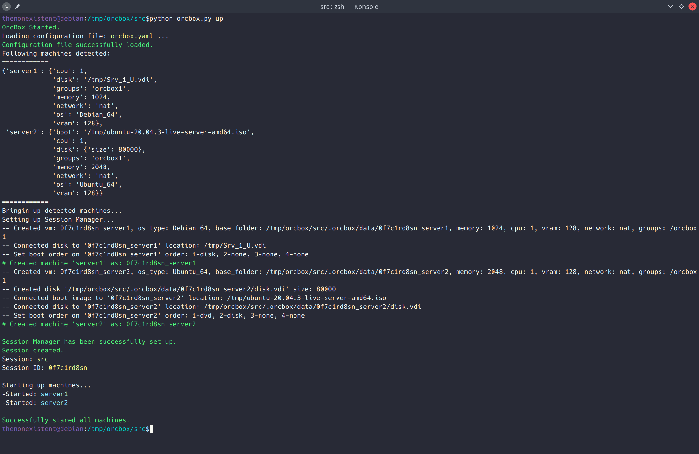
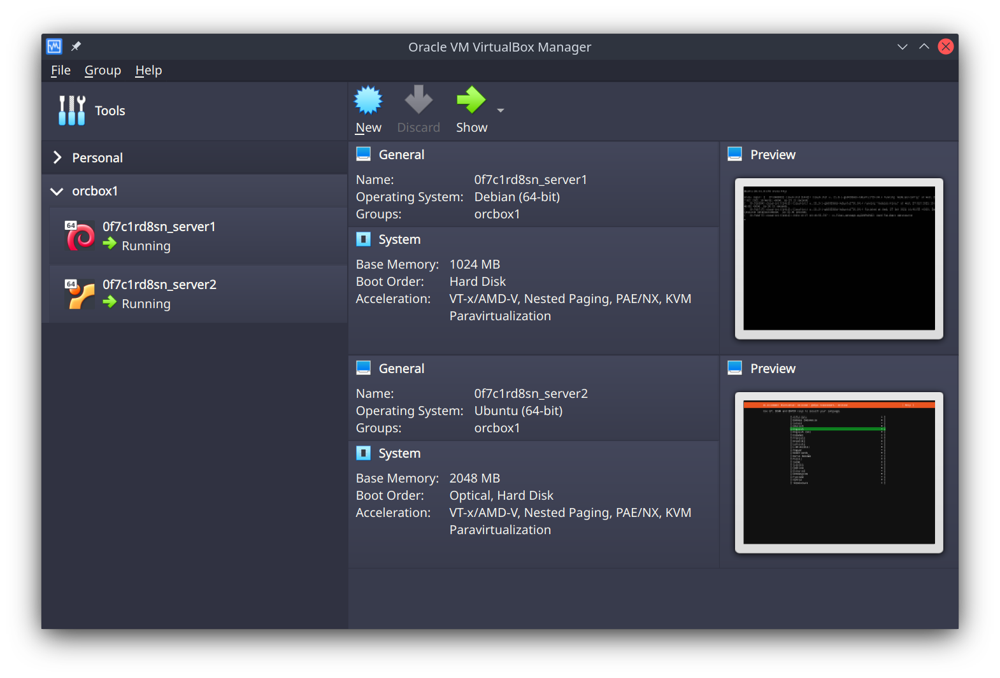

# OrcBox
OrcBox is a Virtual Machine/Infrastructure Configuration And Setup Tool interfacing With VirtualBox and Written In Python. (Intended for testing and development purposes only.)
 Configuration coding is done in the YAML format.
 OrcBox uses VboxManage as an interface for now but this should be changed in the future.
 
 Alpha commands are:
 - up : bring the machines up
 - status : check the status of the machines
 - down : if up, bringe the machines down
 - purge : if up, bringe the machines down and delete them
 
 More commands will be added.
 
 config file: orcbox.yml(default) or can be specified by `-f` or `--file`:
 ```
#If no vdi disk is selected, it will create one and you need to specify a boot image. which is not recommended. By default, disks created by orc will be removed after the machine is turned off. in future an option will be added to preserve it.
#network types: none|null|nat|bridged|intnet|hostonly|

server1:
     os: "Debian_64"
     cpu: 1
     network: "nat"
     memory: 1024
     vram: 128
     disk: "/tmp/VmBlocks/Srv_1_U.vdi"
     groups: orcbox1

server2:
    os: "Ubuntu_64"
    cpu: 1
    network: "nat"
    memory: 2048
    vram: 128
    disk:
        size: 80000
    boot: "/tmp/ubuntu-20.04.3-live-server-amd64.iso"  
    groups: orcbox1

 ```
 
 
 

Any feedback or contribution is welcome.

## Todo:
- [ ] implement a redis connection for session management after the program closes
- [ ] rewrite the interface to use direct vboxapi calls instead of running commands 
- [ ] seperate boot entry in configuration from disk so that machines that have an explicit list can also boot from iso.
- [ ] implement a gracefull exit on cases that machines are up and error occurs. for example during setup if disk configuration of one of the machines is wrong, the already started machines will remain started.
- [ ] convert all paths given in config file to absoloute paths.
- [ ] add copy_disk flag in configuration to allow disk file copying and multiple machines using the same starting disk.
- [ ] implement functionallity so that if one machine is down the up command just brings up that one
- [ ] cloning functionallity so cluster nodes can be defined once and then cloned
- [ ] provide a way to handle this: if an explicit disk is mentioned. it will not be deleted on purge thus if user wants to create a disk and preserve it they should provide a path(for the non existing disk) for the disk to be created and saved there.
